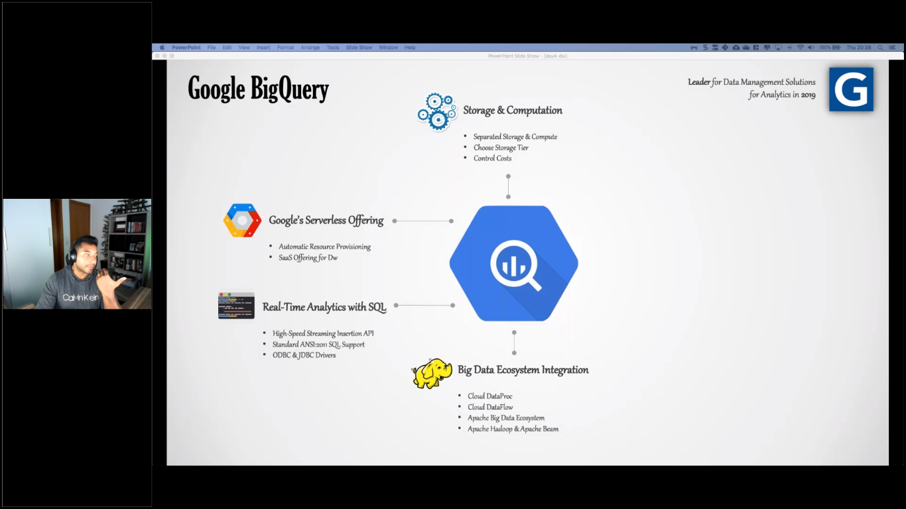

# azure-databricks
Azure Databricks Demos 

# Treinamento
## Data Science no Azure Databricks

 	 
 	 
 	 
 	 
 	 
 	 
 	 
 	 
 	 
 	 
 	 
 	 
 	 
 	 
 	 
 	 
 	 
 	 
 	 
 	 
 	 
 	 
 	 
 	 
 	 
 	 
 	 
 	 
 	 
 	 
 	 
 	 
 	 
 	 
 	 
 	 
 	 
 	 
 	 
 	 
 	 
 	 
 	 
 	 
 	 
 	 
 	 
 	 
 	 
 	 
 	 
 	 
 	 
 	 
 	 
 	 
 	 
 	 
 	 
 	 
 	 
 	 
 	 
 	 
 	 
 	 
 
### Overview

- 15hs não são o suficiente para mostrar tudo de ML
- Mudar para uma abordagem mais Business
- Data Science for Business
- Livro: Data Science for Business - O'Reilly Media
- Curso: Data science for Business - Udacity
- Ferramenta: Azure Databricks and Azure Cognitive Services
- Apresentação Pessoal
- Experiência Pessoal
- "[...]This book is unique in that it does not give a cookbook of algorithms, rather it helps the reader understand the underlying concepts behind data science, and most importantly how to approach and be sucessful at problem solving." - Chirs Volinsky, Director Statistics Research, AT&T Labs and Winner of the $1 Million Netflix Challenge.
- Data Science for Business is intended for several sorts of readers:
  - Business people who will be working with data scientists, managing data science oriented projects, or investing in data science ventures,
  - Developers who will be implementing data science solutions, and
  - Aspiring data scientists.
- This is not a book about algorithms.
- keep math and statistics to a minimum.

- Databricks ML Documentation
- Azure Cognitive Services

### Content

Day 01:

- DS Fundamentals (5W2H)
  - Data Science (What?)
    - Scientific Method
    - Analytics
  - Knowledge Area (Where?)
    - Computer Science
    - IA
    - Machine Learning
  - Context (When?)
    - Cloud
    - Big Data
  - Cases (Why?)
    - Classification
    - Regression
    - Clustering
    - Generalization
    - Association
  - Data Scientist (Who?)
    - Data Scientist vs Data Engineering
    - Data Scientist vs All
  - Tools (How?)
    - R
    - Python
    - Scala
    - Spark
    - Databricks
    - Koalas
  - Career (How much?)
    - Trend & Hype
    - How to become one
    - Suggestions
- DS 101
  - Correlation
  - Linear Regression (Regression)
  - Logistic Regression (Classification)
- DS 102
  - Similarity
  - KNN (Supervised)
  - KMeans (Clustering)
- DS 103
  - PCA (Generalization)
  - Apriori (Association
- DS 104
  - Attribute Selection
  - Cross Validation
  - Metrics

Day 02:

- DS 201
  - Machine Learning Lifecycle
  - Dataset (Raw Data)
  - Text Mining (Data Prep)
  - Naive Bayes (Training)
  - Model Export (Deployment)
  - Review & Examples
- DS 202
  - Model Selection
  - Hyper parametrization
  - Model Evaluation
- DS 302
  - Databricks ML
  - Third Parties ML
  - Cognitive Services
- Hands-on 01
- Hands-on 02

### Reference

1. http://data-science-for-biz.com/
1. https://docs.databricks.com/spark/latest/mllib/index.html
1. https://docs.microsoft.com/en-us/azure/cognitive-services/welcome
# databricks
# databricks
